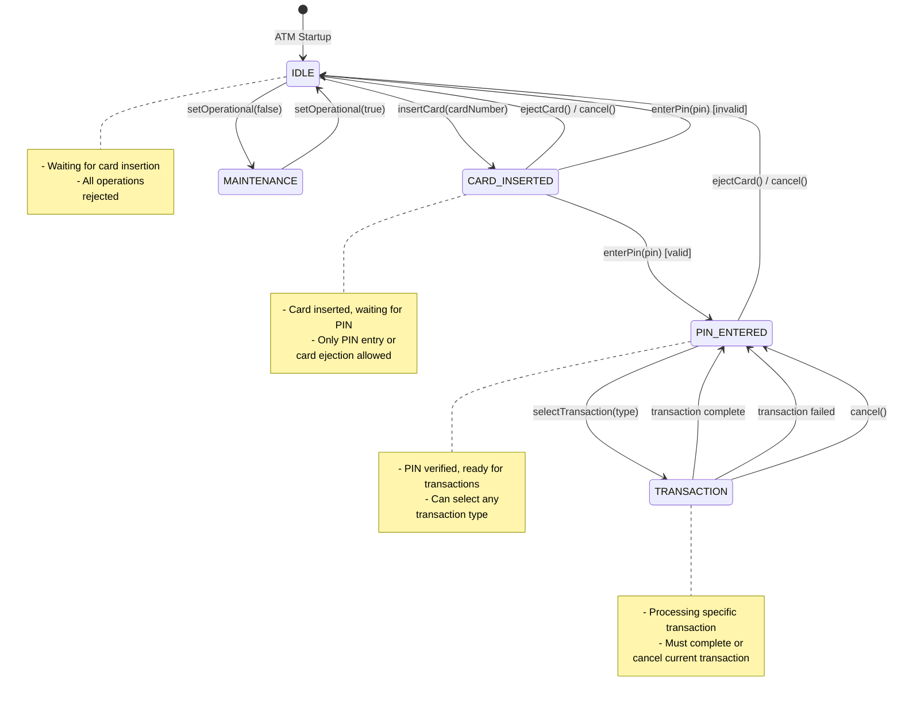
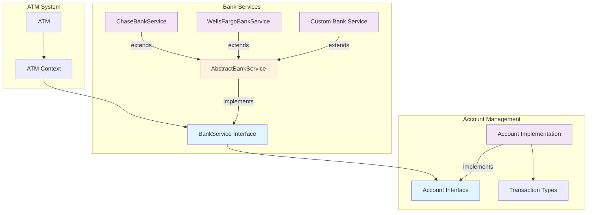
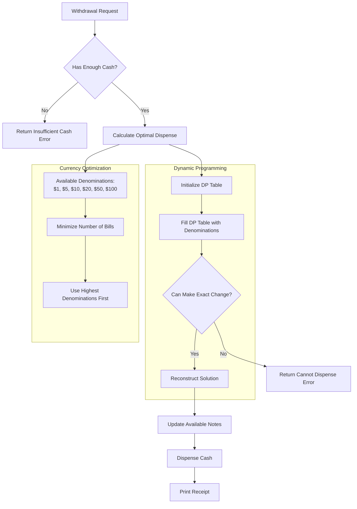

```mermaid
classDiagram
    %% Main ATM System
    class ATM {
        -ATMContext context
        -String atmId
        -String location
        -boolean isOperational
        +insertCard(cardNumber) boolean
        +enterPin(pin) boolean
        +withdrawCash(amount) boolean
        +depositCash(amount) boolean
        +changePin(oldPin, newPin) boolean
        +requestMiniStatement() boolean
        +checkBalance() boolean
        +ejectCard() void
        +cancel() void
    }

    %% State Pattern
    class ATMContext {
        -ATMStateInterface currentState
        -String cardNumber
        -String pin
        -Account currentAccount
        -Transaction currentTransaction
        -Map~String,Object~ stateData
        +setState(newState) void
        +insertCard(cardNumber) void
        +enterPin(pin) void
        +withdrawCash(amount) void
        +depositCash(amount) void
        +changePin(oldPin, newPin) void
        +requestStatement() void
        +ejectCard() void
        +cancel() void
    }

    class ATMStateInterface {
        <<interface>>
        +insertCard(context, cardNumber) void
        +enterPin(context, pin) void
        +selectTransaction(context, type) void
        +withdrawCash(context, amount) void
        +depositCash(context, amount) void
        +changePin(context, oldPin, newPin) void
        +requestStatement(context) void
        +ejectCard(context) void
        +cancel(context) void
        +getStateName() String
    }

    class IdleState {
        +insertCard(context, cardNumber) void
        +enterPin(context, pin) void
        +selectTransaction(context, type) void
        +withdrawCash(context, amount) void
        +depositCash(context, amount) void
        +changePin(context, oldPin, newPin) void
        +requestStatement(context) void
        +ejectCard(context) void
        +cancel(context) void
        +getStateName() String
    }

    class CardInsertedState {
        +insertCard(context, cardNumber) void
        +enterPin(context, pin) void
        +selectTransaction(context, type) void
        +withdrawCash(context, amount) void
        +depositCash(context, amount) void
        +changePin(context, oldPin, newPin) void
        +requestStatement(context) void
        +ejectCard(context) void
        +cancel(context) void
        +getStateName() String
    }

    class PinEnteredState {
        +insertCard(context, cardNumber) void
        +enterPin(context, pin) void
        +selectTransaction(context, type) void
        +withdrawCash(context, amount) void
        +depositCash(context, amount) void
        +changePin(context, oldPin, newPin) void
        +requestStatement(context) void
        +ejectCard(context) void
        +cancel(context) void
        +getStateName() String
    }

    class TransactionState {
        +insertCard(context, cardNumber) void
        +enterPin(context, pin) void
        +selectTransaction(context, type) void
        +withdrawCash(context, amount) void
        +depositCash(context, amount) void
        +changePin(context, oldPin, newPin) void
        +requestStatement(context) void
        +ejectCard(context) void
        +cancel(context) void
        +getStateName() String
    }

    %% Hardware Components
    class CardReader {
        <<interface>>
        +insertCard(cardNumber) boolean
        +ejectCard() boolean
        +getCardNumber() String
        +isCardPresent() boolean
    }

    class CardReaderImpl {
        -String currentCard
        -boolean cardPresent
        +insertCard(cardNumber) boolean
        +ejectCard() boolean
        +getCardNumber() String
        +isCardPresent() boolean
        -isValidCardNumber(cardNumber) boolean
        -maskCardNumber(cardNumber) String
    }

    class PinEntry {
        <<interface>>
        +enterPin(pin) boolean
        +clearPin() void
        +isPinEntered() boolean
    }

    class PinEntryImpl {
        -String enteredPin
        -boolean pinEntered
        -int attemptCount
        -int MAX_ATTEMPTS
        +enterPin(pin) boolean
        +clearPin() void
        +isPinEntered() boolean
        -isValidPin(pin) boolean
        +getAttemptCount() int
        +isMaxAttemptsReached() boolean
    }

    class CashDispenser {
        <<interface>>
        +dispenseCash(amount) boolean
        +getAvailableCash() int
        +hasEnoughCash(amount) boolean
    }

    class CashDispenserImpl {
        -Map~Integer,Integer~ availableNotes
        -int totalCash
        +dispenseCash(amount) boolean
        +getAvailableCash() int
        +hasEnoughCash(amount) boolean
        -initializeNotes() void
        -calculateTotalCash() void
        -calculateOptimalDispense(amount) Map~Integer,Integer~
        -printDispensedNotes(dispensedNotes) void
        +getAvailableNotes() Map~Integer,Integer~
    }

    class Printer {
        <<interface>>
        +printReceipt(transaction) boolean
        +printStatement(statement) boolean
        +isPaperAvailable() boolean
    }

    class PrinterImpl {
        -boolean paperAvailable
        -int paperCount
        +printReceipt(transaction) boolean
        +printStatement(statement) boolean
        +isPaperAvailable() boolean
        -maskCardNumber(cardNumber) String
        +refillPaper() void
    }

    class DepositSlot {
        <<interface>>
        +depositCash(amount) boolean
        +depositCheck(check) boolean
        +getDepositedAmount() int
    }

    class DepositSlotImpl {
        -int depositedAmount
        -List~Check~ depositedChecks
        +depositCash(amount) boolean
        +depositCheck(check) boolean
        +getDepositedAmount() int
        +getDepositedChecks() List~Check~
        +clearDeposits() void
    }

    %% Bank Services
    class BankService {
        <<interface>>
        +validateCard(cardNumber) boolean
        +validatePin(cardNumber, pin) boolean
        +getAccount(cardNumber) Account
        +updateAccount(account) boolean
        +changePin(cardNumber, oldPin, newPin) boolean
    }

    class AbstractBankService {
        #Map~String,Account~ accounts
        #Map~String,String~ cardToAccountMapping
        #Map~String,String~ cardToPinMapping
        +validateCard(cardNumber) boolean
        +validatePin(cardNumber, pin) boolean
        +getAccount(cardNumber) Account
        +updateAccount(account) boolean
        +changePin(cardNumber, oldPin, newPin) boolean
        #initializeBankData()* void
        #additionalCardValidation(cardNumber) boolean
    }

    class ChaseBankService {
        +initializeBankData() void
        +additionalCardValidation(cardNumber) boolean
    }

    class WellsFargoBankService {
        +initializeBankData() void
        +additionalCardValidation(cardNumber) boolean
    }

    %% Models
    class Account {
        <<interface>>
        +getAccountNumber() String
        +getCardNumber() String
        +getBalance() int
        +withdraw(amount) boolean
        +deposit(amount) boolean
        +addTransaction(transaction) void
        +generateStatement(days) AccountStatement
    }

    class AccountImpl {
        -String accountNumber
        -String cardNumber
        -int balance
        -List~Transaction~ transactions
        +getAccountNumber() String
        +getCardNumber() String
        +getBalance() int
        +withdraw(amount) boolean
        +deposit(amount) boolean
        +addTransaction(transaction) void
        +generateStatement(days) AccountStatement
    }

    class Transaction {
        <<interface>>
        +getTransactionId() String
        +getCardNumber() String
        +getAmount() int
        +getType() TransactionType
        +getTimestamp() long
        +execute() boolean
    }

    class BaseTransaction {
        #String transactionId
        #String cardNumber
        #int amount
        #TransactionType type
        #long timestamp
        +getTransactionId() String
        +getCardNumber() String
        +getAmount() int
        +getType() TransactionType
        +getTimestamp() long
        +execute() boolean
        -generateTransactionId() String
    }

    class WithdrawalTransaction {
        +WithdrawalTransaction(cardNumber, amount, timestamp)
        +getType() TransactionType
    }

    class DepositTransaction {
        +DepositTransaction(cardNumber, amount, timestamp)
        +getType() TransactionType
    }

    class PinChangeTransaction {
        +PinChangeTransaction(cardNumber, amount, timestamp)
        +getType() TransactionType
    }

    class AccountStatement {
        <<interface>>
        +getAccountNumber() String
        +getTransactions() List~Transaction~
        +getStartingBalance() int
        +getEndingBalance() int
        +getPeriod() String
    }

    class AccountStatementImpl {
        -String accountNumber
        -List~Transaction~ transactions
        -int startingBalance
        -int endingBalance
        -String period
        +getAccountNumber() String
        +getTransactions() List~Transaction~
        +getStartingBalance() int
        +getEndingBalance() int
        +getPeriod() String
    }

    class Check {
        -String checkNumber
        -int amount
        -String bankName
        +getCheckNumber() String
        +getAmount() int
        +getBankName() String
    }

    class TransactionType {
        <<enumeration>>
        WITHDRAWAL
        DEPOSIT
        PIN_CHANGE
        BALANCE_INQUIRY
        MINI_STATEMENT
    }

    class ATMStatus {
        -String atmId
        -String location
        -boolean isOperational
        -int availableCash
        -boolean paperAvailable
        -boolean cardPresent
        +getAtmId() String
        +getLocation() String
        +isOperational() boolean
        +getAvailableCash() int
        +isPaperAvailable() boolean
        +isCardPresent() boolean
    }

    class ATMFactory {
        +createChaseATM(atmId, location) ATM
        +createWellsFargoATM(atmId, location) ATM
        +createCustomATM(atmId, location, bankService) ATM
    }

    %% Relationships
    ATM --> ATMContext : uses
    ATM --> CardReader : uses
    ATM --> PinEntry : uses
    ATM --> CashDispenser : uses
    ATM --> Printer : uses
    ATM --> DepositSlot : uses
    ATM --> BankService : uses
    ATM --> ATMStatus : creates

    ATMContext --> ATMStateInterface : uses
    ATMContext --> CardReader : uses
    ATMContext --> PinEntry : uses
    ATMContext --> CashDispenser : uses
    ATMContext --> Printer : uses
    ATMContext --> DepositSlot : uses
    ATMContext --> BankService : uses

    ATMStateInterface <|-- IdleState : implements
    ATMStateInterface <|-- CardInsertedState : implements
    ATMStateInterface <|-- PinEnteredState : implements
    ATMStateInterface <|-- TransactionState : implements

    CardReader <|-- CardReaderImpl : implements
    PinEntry <|-- PinEntryImpl : implements
    CashDispenser <|-- CashDispenserImpl : implements
    Printer <|-- PrinterImpl : implements
    DepositSlot <|-- DepositSlotImpl : implements

    AbstractBankService ..|> BankService
    AbstractBankService <|-- ChaseBankService : extends
    AbstractBankService <|-- WellsFargoBankService : extends

    Account <|-- AccountImpl : implements
    Transaction <|-- BaseTransaction : implements
    BaseTransaction <|-- WithdrawalTransaction : extends
    BaseTransaction <|-- DepositTransaction : extends
    BaseTransaction <|-- PinChangeTransaction : extends

    AccountStatement <|-- AccountStatementImpl : implements

    ATMFactory --> ATM : creates
    ATMFactory --> ChaseBankService : uses
    ATMFactory --> WellsFargoBankService : uses

    AccountImpl --> Transaction : contains
    AccountImpl --> AccountStatement : creates
    AccountStatementImpl --> Transaction : contains

    TransactionState --> WithdrawalTransaction : creates
    TransactionState --> DepositTransaction : creates
    TransactionState --> PinChangeTransaction : creates
    TransactionState --> AccountStatement : uses

    DepositSlotImpl --> Check : uses
```

## 🔄 State Transition Diagram

```mermaid
stateDiagram-v2
    [*] --> IDLE : ATM Startup
    
    IDLE --> CARD_INSERTED : insertCard(cardNumber)
    CARD_INSERTED --> IDLE : ejectCard() / cancel()
    CARD_INSERTED --> PIN_ENTERED : enterPin(pin) [valid]
    CARD_INSERTED --> IDLE : enterPin(pin) [invalid]
    
    PIN_ENTERED --> TRANSACTION : selectTransaction(type)
    PIN_ENTERED --> IDLE : ejectCard() / cancel()
    
    TRANSACTION --> PIN_ENTERED : transaction complete
    TRANSACTION --> PIN_ENTERED : transaction failed
    TRANSACTION --> PIN_ENTERED : cancel()
    
    IDLE --> MAINTENANCE : setOperational(false)
    MAINTENANCE --> IDLE : setOperational(true)
    
    note right of IDLE
        - Waiting for card insertion
        - All operations rejected
    end note
    
    note right of CARD_INSERTED
        - Card inserted, waiting for PIN
        - Only PIN entry or card ejection allowed
    end note
    
    note right of PIN_ENTERED
        - PIN verified, ready for transactions
        - Can select any transaction type
    end note
    
    note right of TRANSACTION
        - Processing specific transaction
        - Must complete or cancel current transaction
    end note
```

## 🏦 Bank Service Architecture

```mermaid
graph TB
    subgraph "ATM System"
        ATM[ATM]
        ATMContext[ATM Context]
    end
    
    subgraph "Bank Services"
        BankService[BankService Interface]
        AbstractBank[AbstractBankService]
        ChaseBank[ChaseBankService]
        WellsFargo[WellsFargoBankService]
        CustomBank[Custom Bank Service]
    end
    
    subgraph "Account Management"
        Account[Account Interface]
        AccountImpl[Account Implementation]
        Transaction[Transaction Types]
    end
    
    ATM --> ATMContext
    ATMContext --> BankService
    AbstractBank -->|implements| BankService
    ChaseBank -->|extends| AbstractBank
    WellsFargo -->|extends| AbstractBank
    CustomBank -->|extends| AbstractBank
    
    BankService --> Account
    AccountImpl -->|implements| Account
    AccountImpl --> Transaction
    
    classDef interface fill:#e1f5fe
    classDef implementation fill:#f3e5f5
    classDef abstract fill:#fff3e0
    
    class BankService,Account interface
    class ChaseBank,WellsFargo,CustomBank,AccountImpl implementation
    class AbstractBank abstract
```

## 💰 Cash Dispenser Algorithm Flow

```mermaid
flowchart TD
    A[Withdrawal Request] --> B{Has Enough Cash?}
    B -->|No| C[Return Insufficient Cash Error]
    B -->|Yes| D[Calculate Optimal Dispense]
    
    D --> E[Initialize DP Table]
    E --> F[Fill DP Table with Denominations]
    F --> G{Can Make Exact Change?}
    
    G -->|No| H[Return Cannot Dispense Error]
    G -->|Yes| I[Reconstruct Solution]
    
    I --> J[Update Available Notes]
    J --> K[Dispense Cash]
    K --> L[Print Receipt]
    
    subgraph "Dynamic Programming"
        E
        F
        G
        I
    end
    
    subgraph "Currency Optimization"
        M[Available Denominations:<br/>$1, $5, $10, $20, $50, $100]
        N[Minimize Number of Bills]
        O[Use Highest Denominations First]
    end
    
    D --> M
    M --> N
    N --> O
```
