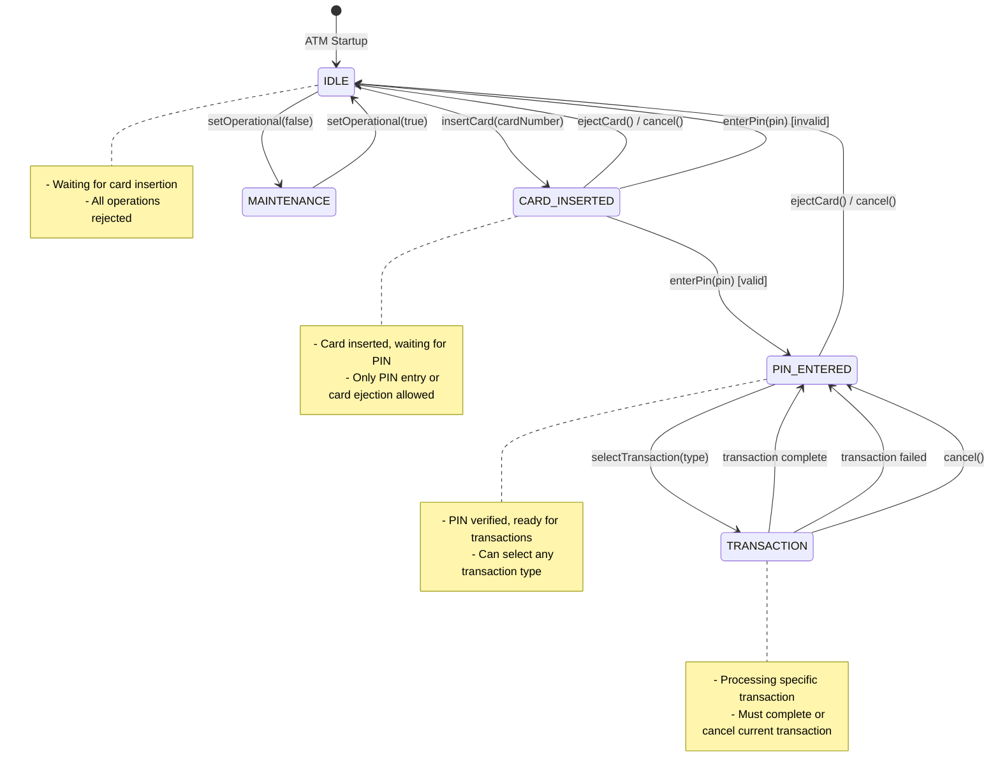
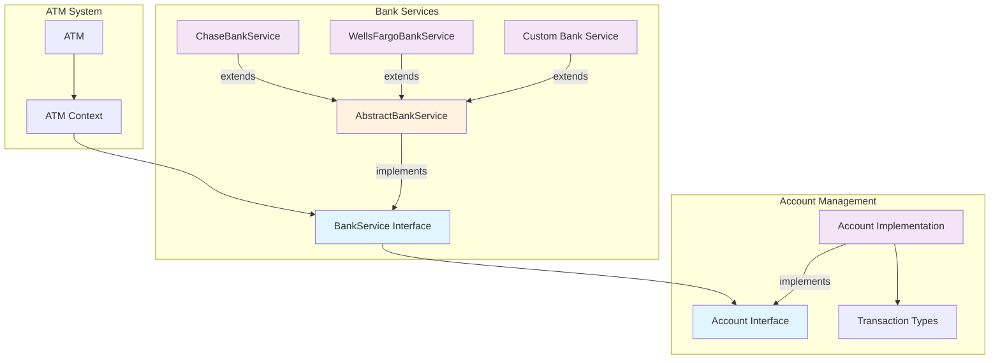
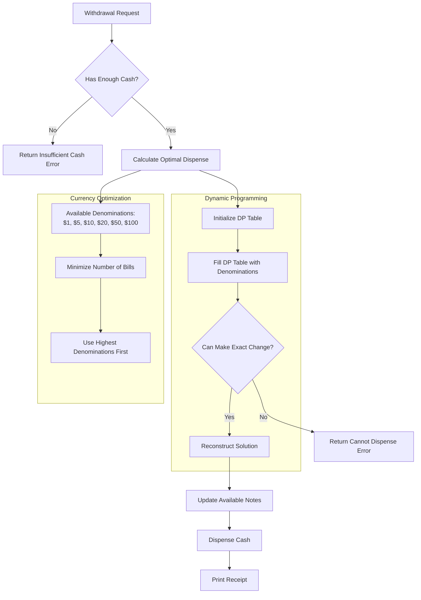

# ATM System - Low Level Design

A comprehensive ATM system implementation using the State Design Pattern and following SOLID principles.

## 🏗️ Architecture Overview

This ATM system is designed with clean architecture principles, featuring:

- **State Design Pattern** for managing ATM states
- **SOLID Principles** for maintainable and extensible code
- **Dynamic Programming** for optimal cash dispensing
- **Extensible Bank Services** for multi-bank support

## 📊 UML Class Diagram

```mermaid
classDiagram
    %% Main ATM System
    class ATM {
        -ATMContext context
        -String atmId
        -String location
        -boolean isOperational
        +insertCard(cardNumber) boolean
        +enterPin(pin) boolean
        +withdrawCash(amount) boolean
        +depositCash(amount) boolean
        +changePin(oldPin, newPin) boolean
        +requestMiniStatement() boolean
        +checkBalance() boolean
        +ejectCard() void
        +cancel() void
    }

    %% State Pattern
    class ATMContext {
        -ATMStateInterface currentState
        -String cardNumber
        -String pin
        -Account currentAccount
        -Transaction currentTransaction
        -Map~String,Object~ stateData
        +setState(newState) void
        +insertCard(cardNumber) void
        +enterPin(pin) void
        +withdrawCash(amount) void
        +depositCash(amount) void
        +changePin(oldPin, newPin) void
        +requestStatement() void
        +ejectCard() void
        +cancel() void
    }

    class ATMStateInterface {
        <<interface>>
        +insertCard(context, cardNumber) void
        +enterPin(context, pin) void
        +selectTransaction(context, type) void
        +withdrawCash(context, amount) void
        +depositCash(context, amount) void
        +changePin(context, oldPin, newPin) void
        +requestStatement(context) void
        +ejectCard(context) void
        +cancel(context) void
        +getStateName() String
    }

    class IdleState {
        +insertCard(context, cardNumber) void
        +enterPin(context, pin) void
        +selectTransaction(context, type) void
        +withdrawCash(context, amount) void
        +depositCash(context, amount) void
        +changePin(context, oldPin, newPin) void
        +requestStatement(context) void
        +ejectCard(context) void
        +cancel(context) void
        +getStateName() String
    }

    class CardInsertedState {
        +insertCard(context, cardNumber) void
        +enterPin(context, pin) void
        +selectTransaction(context, type) void
        +withdrawCash(context, amount) void
        +depositCash(context, amount) void
        +changePin(context, oldPin, newPin) void
        +requestStatement(context) void
        +ejectCard(context) void
        +cancel(context) void
        +getStateName() String
    }

    class PinEnteredState {
        +insertCard(context, cardNumber) void
        +enterPin(context, pin) void
        +selectTransaction(context, type) void
        +withdrawCash(context, amount) void
        +depositCash(context, amount) void
        +changePin(context, oldPin, newPin) void
        +requestStatement(context) void
        +ejectCard(context) void
        +cancel(context) void
        +getStateName() String
    }

    class TransactionState {
        +insertCard(context, cardNumber) void
        +enterPin(context, pin) void
        +selectTransaction(context, type) void
        +withdrawCash(context, amount) void
        +depositCash(context, amount) void
        +changePin(context, oldPin, newPin) void
        +requestStatement(context) void
        +ejectCard(context) void
        +cancel(context) void
        +getStateName() String
    }

    %% Hardware Components
    class CardReader {
        <<interface>>
        +insertCard(cardNumber) boolean
        +ejectCard() boolean
        +getCardNumber() String
        +isCardPresent() boolean
    }

    class CardReaderImpl {
        -String currentCard
        -boolean cardPresent
        +insertCard(cardNumber) boolean
        +ejectCard() boolean
        +getCardNumber() String
        +isCardPresent() boolean
        -isValidCardNumber(cardNumber) boolean
        -maskCardNumber(cardNumber) String
    }

    class PinEntry {
        <<interface>>
        +enterPin(pin) boolean
        +clearPin() void
        +isPinEntered() boolean
    }

    class PinEntryImpl {
        -String enteredPin
        -boolean pinEntered
        -int attemptCount
        -int MAX_ATTEMPTS
        +enterPin(pin) boolean
        +clearPin() void
        +isPinEntered() boolean
        -isValidPin(pin) boolean
        +getAttemptCount() int
        +isMaxAttemptsReached() boolean
    }

    class CashDispenser {
        <<interface>>
        +dispenseCash(amount) boolean
        +getAvailableCash() int
        +hasEnoughCash(amount) boolean
    }

    class CashDispenserImpl {
        -Map~Integer,Integer~ availableNotes
        -int totalCash
        +dispenseCash(amount) boolean
        +getAvailableCash() int
        +hasEnoughCash(amount) boolean
        -initializeNotes() void
        -calculateTotalCash() void
        -calculateOptimalDispense(amount) Map~Integer,Integer~
        -printDispensedNotes(dispensedNotes) void
        +getAvailableNotes() Map~Integer,Integer~
    }

    class Printer {
        <<interface>>
        +printReceipt(transaction) boolean
        +printStatement(statement) boolean
        +isPaperAvailable() boolean
    }

    class PrinterImpl {
        -boolean paperAvailable
        -int paperCount
        +printReceipt(transaction) boolean
        +printStatement(statement) boolean
        +isPaperAvailable() boolean
        -maskCardNumber(cardNumber) String
        +refillPaper() void
    }

    class DepositSlot {
        <<interface>>
        +depositCash(amount) boolean
        +depositCheck(check) boolean
        +getDepositedAmount() int
    }

    class DepositSlotImpl {
        -int depositedAmount
        -List~Check~ depositedChecks
        +depositCash(amount) boolean
        +depositCheck(check) boolean
        +getDepositedAmount() int
        +getDepositedChecks() List~Check~
        +clearDeposits() void
    }

    %% Bank Services
    class BankService {
        <<interface>>
        +validateCard(cardNumber) boolean
        +validatePin(cardNumber, pin) boolean
        +getAccount(cardNumber) Account
        +updateAccount(account) boolean
        +changePin(cardNumber, oldPin, newPin) boolean
    }

    class AbstractBankService {
        #Map~String,Account~ accounts
        #Map~String,String~ cardToAccountMapping
        #Map~String,String~ cardToPinMapping
        +validateCard(cardNumber) boolean
        +validatePin(cardNumber, pin) boolean
        +getAccount(cardNumber) Account
        +updateAccount(account) boolean
        +changePin(cardNumber, oldPin, newPin) boolean
        #initializeBankData()* void
        #additionalCardValidation(cardNumber) boolean
    }

    class ChaseBankService {
        +initializeBankData() void
        +additionalCardValidation(cardNumber) boolean
    }

    class WellsFargoBankService {
        +initializeBankData() void
        +additionalCardValidation(cardNumber) boolean
    }

    %% Models
    class Account {
        <<interface>>
        +getAccountNumber() String
        +getCardNumber() String
        +getBalance() int
        +withdraw(amount) boolean
        +deposit(amount) boolean
        +addTransaction(transaction) void
        +generateStatement(days) AccountStatement
    }

    class AccountImpl {
        -String accountNumber
        -String cardNumber
        -int balance
        -List~Transaction~ transactions
        +getAccountNumber() String
        +getCardNumber() String
        +getBalance() int
        +withdraw(amount) boolean
        +deposit(amount) boolean
        +addTransaction(transaction) void
        +generateStatement(days) AccountStatement
    }

    class Transaction {
        <<interface>>
        +getTransactionId() String
        +getCardNumber() String
        +getAmount() int
        +getType() TransactionType
        +getTimestamp() long
        +execute() boolean
    }

    class BaseTransaction {
        #String transactionId
        #String cardNumber
        #int amount
        #TransactionType type
        #long timestamp
        +getTransactionId() String
        +getCardNumber() String
        +getAmount() int
        +getType() TransactionType
        +getTimestamp() long
        +execute() boolean
        -generateTransactionId() String
    }

    class WithdrawalTransaction {
        +WithdrawalTransaction(cardNumber, amount, timestamp)
        +getType() TransactionType
    }

    class DepositTransaction {
        +DepositTransaction(cardNumber, amount, timestamp)
        +getType() TransactionType
    }

    class PinChangeTransaction {
        +PinChangeTransaction(cardNumber, amount, timestamp)
        +getType() TransactionType
    }

    class AccountStatement {
        <<interface>>
        +getAccountNumber() String
        +getTransactions() List~Transaction~
        +getStartingBalance() int
        +getEndingBalance() int
        +getPeriod() String
    }

    class AccountStatementImpl {
        -String accountNumber
        -List~Transaction~ transactions
        -int startingBalance
        -int endingBalance
        -String period
        +getAccountNumber() String
        +getTransactions() List~Transaction~
        +getStartingBalance() int
        +getEndingBalance() int
        +getPeriod() String
    }

    class Check {
        -String checkNumber
        -int amount
        -String bankName
        +getCheckNumber() String
        +getAmount() int
        +getBankName() String
    }

    class TransactionType {
        <<enumeration>>
        WITHDRAWAL
        DEPOSIT
        PIN_CHANGE
        BALANCE_INQUIRY
        MINI_STATEMENT
    }

    class ATMStatus {
        -String atmId
        -String location
        -boolean isOperational
        -int availableCash
        -boolean paperAvailable
        -boolean cardPresent
        +getAtmId() String
        +getLocation() String
        +isOperational() boolean
        +getAvailableCash() int
        +isPaperAvailable() boolean
        +isCardPresent() boolean
    }

    class ATMFactory {
        +createChaseATM(atmId, location) ATM
        +createWellsFargoATM(atmId, location) ATM
        +createCustomATM(atmId, location, bankService) ATM
    }

    %% Relationships
    ATM --> ATMContext : uses
    ATM --> CardReader : uses
    ATM --> PinEntry : uses
    ATM --> CashDispenser : uses
    ATM --> Printer : uses
    ATM --> DepositSlot : uses
    ATM --> BankService : uses
    ATM --> ATMStatus : creates

    ATMContext --> ATMStateInterface : uses
    ATMContext --> CardReader : uses
    ATMContext --> PinEntry : uses
    ATMContext --> CashDispenser : uses
    ATMContext --> Printer : uses
    ATMContext --> DepositSlot : uses
    ATMContext --> BankService : uses

    ATMStateInterface <|-- IdleState : implements
    ATMStateInterface <|-- CardInsertedState : implements
    ATMStateInterface <|-- PinEnteredState : implements
    ATMStateInterface <|-- TransactionState : implements

    CardReader <|-- CardReaderImpl : implements
    PinEntry <|-- PinEntryImpl : implements
    CashDispenser <|-- CashDispenserImpl : implements
    Printer <|-- PrinterImpl : implements
    DepositSlot <|-- DepositSlotImpl : implements

    AbstractBankService ..|> BankService
    AbstractBankService <|-- ChaseBankService : extends
    AbstractBankService <|-- WellsFargoBankService : extends

    Account <|-- AccountImpl : implements
    Transaction <|-- BaseTransaction : implements
    BaseTransaction <|-- WithdrawalTransaction : extends
    BaseTransaction <|-- DepositTransaction : extends
    BaseTransaction <|-- PinChangeTransaction : extends

    AccountStatement <|-- AccountStatementImpl : implements

    ATMFactory --> ATM : creates
    ATMFactory --> ChaseBankService : uses
    ATMFactory --> WellsFargoBankService : uses

    AccountImpl --> Transaction : contains
    AccountImpl --> AccountStatement : creates
    AccountStatementImpl --> Transaction : contains

    TransactionState --> WithdrawalTransaction : creates
    TransactionState --> DepositTransaction : creates
    TransactionState --> PinChangeTransaction : creates
    TransactionState --> AccountStatement : uses

    DepositSlotImpl --> Check : uses
```



## 🔄 State Transition Diagram



## 🏦 Bank Service Architecture



## 💰 Cash Dispenser Algorithm Flow



## 📁 Project Structure

```
src/main/java/atm/
├── interfaces/           # Core interfaces (SOLID - Interface Segregation)
│   ├── CardReader.java
│   ├── PinEntry.java
│   ├── CashDispenser.java
│   ├── Printer.java
│   ├── DepositSlot.java
│   └── BankService.java
├── models/              # Data models and enums
│   ├── TransactionType.java
│   ├── ATMState.java
│   ├── Check.java
│   ├── Transaction.java
│   ├── Account.java
│   ├── AccountStatement.java
│   ├── BaseTransaction.java
│   ├── WithdrawalTransaction.java
│   ├── DepositTransaction.java
│   ├── PinChangeTransaction.java
│   ├── BalanceInquiryTransaction.java
│   ├── AccountImpl.java
│   ├── AccountStatementImpl.java
│   └── ATMStatus.java
├── states/              # State Design Pattern implementation
│   ├── ATMStateInterface.java
│   ├── ATMContext.java
│   ├── IdleState.java
│   ├── CardInsertedState.java
│   ├── PinEnteredState.java
│   └── TransactionState.java
├── components/          # Hardware component implementations
│   ├── CardReaderImpl.java
│   ├── PinEntryImpl.java
│   ├── CashDispenserImpl.java
│   ├── PrinterImpl.java
│   └── DepositSlotImpl.java
├── services/            # Bank service implementations
│   ├── AbstractBankService.java
│   ├── ChaseBankService.java
│   └── WellsFargoBankService.java
├── ATM.java            # Main ATM orchestrator
├── ATMFactory.java     # Factory for creating ATMs
├── ATMDemo.java        # Feature demo (concise)
└── ATMCompleteDemo.java# Comprehensive feature demo
```

## 🎯 Key Features

### 1. State Design Pattern
- **IdleState**: ATM waiting for card insertion
- **CardInsertedState**: Card inserted, waiting for PIN
- **PinEnteredState**: PIN verified, ready for transactions
- **TransactionState**: Processing specific transactions

### 2. SOLID Principles Implementation

#### Single Responsibility Principle (SRP)
- Each class has one reason to change
- Separate files for each class/interface
- Clear separation of concerns

#### Open/Closed Principle (OCP)
- Abstract `BankService` allows extension without modification
- New banks can be added by extending `AbstractBankService`
- New transaction types can be added by extending `BaseTransaction`

#### Liskov Substitution Principle (LSP)
- All implementations can be substituted for their interfaces
- State implementations are interchangeable

#### Interface Segregation Principle (ISP)
- Small, focused interfaces
- Clients depend only on methods they use

#### Dependency Inversion Principle (DIP)
- High-level modules depend on abstractions
- ATM depends on interfaces, not concrete implementations

### 3. Cash Dispenser Optimization
- **Dynamic Programming** algorithm for optimal currency distribution
- Minimizes number of bills dispensed
- Handles various denominations efficiently

### 4. Extensible Bank Support
- Abstract bank service for easy extension
- Multiple bank implementations (Chase, Wells Fargo)
- Bank-specific validation rules

## 🚀 Usage Examples

### Basic ATM Operations

```java
// Create ATM instance
ATM atm = ATMFactory.createChaseATM("ATM001", "Downtown Branch");

// Insert card
atm.insertCard("1234567890123456");

// Enter PIN
atm.enterPin("1234");

// Check balance
atm.checkBalance();

// Withdraw cash
atm.withdrawCash(500);

// Deposit cash
atm.depositCash(200);

// Change PIN
atm.changePin("1234", "9999");

// Request mini statement
atm.requestMiniStatement();

// Eject card
atm.ejectCard();
```

### Error Handling

```java
// Invalid card
atm.insertCard("0000000000000000"); // Returns false

// Invalid PIN (with attempt limiting)
atm.enterPin("9999"); // Shows remaining attempts

// Insufficient funds
atm.withdrawCash(100000); // Validates account balance

// ATM out of service
atm.setOperational(false);
atm.withdrawCash(100); // Shows "ATM is currently out of service"
```

### Maintenance Operations

```java
// Check ATM status
ATMStatus status = atm.getStatus();
System.out.println(status);

// Refill cash
Map<Integer, Integer> cashToAdd = new HashMap<>();
cashToAdd.put(20, 50);  // Add 50 $20 bills
cashToAdd.put(50, 20);  // Add 20 $50 bills
atm.refillCash(cashToAdd);

// Refill paper
atm.refillPaper();
```

## 🔧 Design Patterns Used

### 1. State Design Pattern
- Manages ATM behavior based on current state
- Clean state transitions
- Easy to add new states

### 2. Factory Pattern
- `ATMFactory` creates ATM instances
- Encapsulates ATM creation logic
- Easy to add new ATM types

### 3. Template Method Pattern
- `AbstractBankService` provides common functionality
- Subclasses implement bank-specific logic
- Consistent interface across banks

### 4. Strategy Pattern
- Different transaction types implement common interface
- Easy to add new transaction types
- Polymorphic transaction handling

## 🧮 Cash Dispenser Algorithm

The cash dispenser uses dynamic programming to minimize the number of bills:

```java
// DP table: dp[i] = minimum number of notes needed for amount i
int[] dp = new int[amount + 1];
int[] parent = new int[amount + 1]; // Track which denomination was used

// Fill DP table
for (int i = 1; i <= amount; i++) {
    for (int denomination : denominations) {
        if (i >= denomination && dp[i - denomination] != Integer.MAX_VALUE) {
            if (dp[i - denomination] + 1 < dp[i]) {
                dp[i] = dp[i - denomination] + 1;
                parent[i] = denomination;
            }
        }
    }
}
```

## 🏦 Bank Extensibility

Adding a new bank is simple:

```java
public class NewBankService extends AbstractBankService {
    @Override
    protected void initializeBankData() {
        // Initialize bank-specific accounts and cards
    }
    
    @Override
    protected boolean additionalCardValidation(String cardNumber) {
        // Bank-specific validation rules
        return cardNumber.startsWith("NEWBANK");
    }
}

// Create ATM with new bank
ATM newBankATM = ATMFactory.createCustomATM("ATM003", "New Location", new NewBankService());
```

## 🧪 Testing

Run a demo to see the system in action:

```bash
cd src/main/java
javac atm/*.java atm/*/*.java
java atm.ATMDemo   # or: java atm.ATMCompleteDemo
```

## 📋 Requirements Fulfilled

✅ **Card Reader**: Interface and implementation for card insertion/ejection  
✅ **PIN Entry**: Physical/digital PIN input with attempt limiting  
✅ **Cash Dispenser**: Optimized currency distribution using dynamic programming  
✅ **Printer**: Receipt and statement printing functionality  
✅ **Mini Statement**: Account statement generation  
✅ **Multi-Bank Support**: Extensible bank service architecture  
✅ **PIN Change**: Secure PIN modification functionality  
✅ **Deposit Slot**: Separate deposit functionality from cash dispenser  
✅ **State Design Pattern**: Clean state management  
✅ **SOLID Principles**: Maintainable and extensible code structure  

## 🔒 Security Features

- PIN attempt limiting (max 3 attempts)
- Card validation
- Transaction logging
- Secure PIN change process
- Input validation

## 🚀 Future Enhancements

- Database integration for persistent storage
- Network communication for real-time bank validation
- Encryption for sensitive data
- Audit logging
- Multi-currency support
- Mobile app integration
- Biometric authentication
